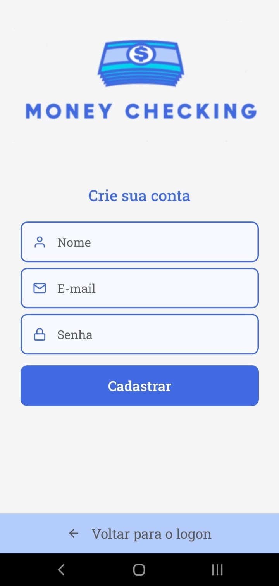

<h1 align="center"> Money Checking App</h1>

<p align="center">
  <a href="#tecnologias">Tecnologias</a>&nbsp;&nbsp;&nbsp;|&nbsp;&nbsp;&nbsp;
  <a href="#projeto">Projeto</a>&nbsp;&nbsp;&nbsp;|&nbsp;&nbsp;&nbsp;
  <a href="#executar">Como Executar</a>&nbsp;&nbsp;&nbsp;|&nbsp;&nbsp;&nbsp;
  <a href="#imagens">Imagens</a>&nbsp;&nbsp;&nbsp;
</p>

<br>

# Tecnologias

Esse projeto foi desenvolvido com as seguintes tecnologias:

- React Native
- Expo
- Typescript
- Babel
- Git e Github

# Projeto

O aplicativo mobile Money Checking foi feito para realizar lançamentos financeiros a partir de qualquer lugar por meio de um celular. No aplicativo, é possível criar uma conta, cadastrar, editar e excluir lançamentos e pesquisar por lançamentos feitos. No cadastro de lançamentos existe a opção de lançar uma entrada ou uma saída e conforme os lançamentos são feitos o aplicativo exibe o saldo mensal deles, ajudando na gestão financeira do usuário.

# Executar

- Primeiramente o backend dessa aplicação (que pode ser encontrado aqui: https://github.com/gvolke/backend-money-checking) deve estar sendo executado.
- Após isso é necessário baixar o aplicativo do expo ou um emulador para rodar a aplicação
- Também é necessário mudar no arquivo src/services/api.ts de 'localhost' para o ip da sua máquina

```bash
  # Instalar as dependências:
  $ yarn

  # Iniciar a aplicação:
  $ yarn start
```

Com a aplicação iniciada basta seguiur as instruções para executar onde desejar, seja no emulador ou no aplicativo do expo (Android ou Ios)

# Imagens

<div style="display: flex; flex-direction: column; align-items: center;">  
  <div> 
    
    
        
  </div>

  <div>
    
    
    
  </div>  
</div>
